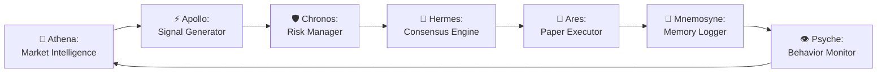
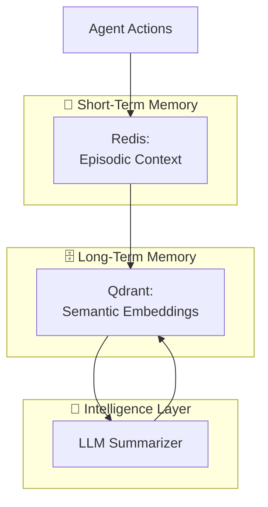

# 🌌 LumosTrade

```
╔══════════════════════════════════════════════════════════════════════════╗
║                                                                          ║
║   ██╗     ██╗   ██╗███╗   ███╗ ██████╗ ███████╗████████╗██████╗  █████╗ ██████╗ ███████╗   ║
║   ██║     ██║   ██║████╗ ████║██╔═══██╗██╔════╝╚══██╔══╝██╔══██╗██╔══██╗██╔══██╗██╔════╝   ║
║   ██║     ██║   ██║██╔████╔██║██║   ██║███████╗   ██║   ██████╔╝███████║██║  ██║█████╗     ║
║   ██║     ██║   ██║██║╚██╔╝██║██║   ██║╚════██║   ██║   ██╔══██╗██╔══██║██║  ██║██╔══╝     ║
║   ███████╗╚██████╔╝██║ ╚═╝ ██║╚██████╔╝███████║   ██║   ██║  ██║██║  ██║██████╔╝███████╗   ║
║   ╚══════╝ ╚═════╝ ╚═╝     ╚═╝ ╚═════╝ ╚══════╝   ╚═╝   ╚═╝  ╚═╝╚═╝  ╚═╝╚═════╝ ╚══════╝   ║
║                                                                          ║
║            🧠 A Cognitive Trading Terminal — Where AI Agents             ║
║                  Observe, Reason, and Trade Together                    ║
║                                                                          ║
╚══════════════════════════════════════════════════════════════════════════╝
```

<div align="center">

[](LICENSE)
[](https://www.python.org/downloads/)
[](https://github.com/psf/black)

**[Quick Start](#-quick-start)** • **[Architecture](#-architecture)** • **[Commands](#-interactive-commands)** • **[Roadmap](#-roadmap)**

</div>

---

## 🧭 Overview

**LumosTrade** is an AI-powered, multi-agent trading terminal designed for **cognitive market analysis**, **decision-making**, and **behavioral feedback** — entirely within your terminal.

It combines:

🧠 **Multi-Agent Collaboration** – Seven specialized AI agents working in harmony  
💹 **Paper Trading Integration** – Safe, realistic trade execution without real capital  
🧩 **Persistent AI Memory System** – Agents remember, learn, and evolve  
👁️ **Behavioral Observation & Coaching** – Psyche agent tracks patterns and biases  

> **"A Cognitive Trading Terminal — where AI agents observe, reason, and trade together."**

---

## 🎯 Core Concept

```
[ATHENA] → Market Intelligence
    ↓
[APOLLO] → Signal Generation
    ↓
[CHRONOS] → Risk Evaluation
    ↓
[HERMES] → Consensus & Governance
    ↓
[ARES] → Execution
    ↓
[MNEMOSYNE] → Memory & Learning
    ↓
[PSYCHE] → Behavioral Awareness
    ↓
    └─────────────────┘
         (Feedback Loop)
```

Each agent observes the market, collaborates, and learns — building a **"collective intelligence"** that evolves through trades.

---

## 🧩 Architecture



> 💡 **Note**: Each agent stores and retrieves context through a shared **Memory Core** (Qdrant + Redis + LLM summarization).

---

## 💻 Terminal Demo

```
╔══════════════════════════════════════════════════════════════════╗
║ LUMOSTRADE TERMINAL  |  Session: 2025-10-15  |  MODE: PAPER     ║
╠══════════════════════════════════════════════════════════════════╣
║                                                                  ║
║  [🧭 Athena]: Market scan complete. BTC/USD volatility rising.   ║
║  [⚡ Apollo]: Proposed trade → BUY @ 60,420 (Confidence: 0.78)   ║
║  [🛡️ Chronos]: Risk OK (score 0.21)                              ║
║  [💬 Hermes]: Consensus ✅ Approved                               ║
║  [🚀 Ares]: Paper trade executed successfully.                   ║
║  [🧠 Mnemosyne]: Logged context to session_104.json              ║
║  [👁️ Psyche]: Pattern detected: Bullish bias in last 3 trades    ║
║                                                                  ║
╚══════════════════════════════════════════════════════════════════╝

Command > psyche review
```

---

## 🧠 Agent Breakdown

| Agent | Role | Example Output |
|-------|------|----------------|
| 🧭 **Athena** | Market Analyst | "BTC is consolidating with rising volatility." |
| ⚡ **Apollo** | Signal Generator | "BUY @ 60,420 (Confidence: 0.78)" |
| 🛡️ **Chronos** | Risk Manager | "Approved, Exposure 0.9%, Risk Score 0.22" |
| 💬 **Hermes** | Consensus Mediator | "Consensus Reached ✅" |
| 🚀 **Ares** | Executor | "Trade executed on paper API" |
| 🧠 **Mnemosyne** | Memory System | "Session logged, similar to 2025-05-14" |
| 👁️ **Psyche** | Behavior Tracker | "Detected risk-seeking bias in recent decisions" |

---

## ⚙️ Memory System



**LumosTrade's MemoryCore** allows agents to:
- 💾 Store reasoning and trade context
- 🔍 Recall similar past trades semantically
- 📈 Learn from outcomes and adapt strategies

---

## 🧰 Installation & Setup

### Prerequisites

- **Python 3.10+**
- **Poetry** or **pip**
- **Docker** (for Redis & Qdrant)
- API Keys: OpenAI/Anthropic, Alpha Vantage/Alpaca

### Step-by-Step Installation

```bash
# Clone the repository
git clone https://github.com/ysrastogi/lumosTrade.git
cd lumosTrade

# Install dependencies using Poetry
poetry install

# OR using pip
pip install -r requirements.txt

# Copy environment template
cp .env.example .env

# Edit .env and add your API keys
nano .env
```

### Initialize Memory Systems

```bash
# Start Redis and Qdrant with Docker Compose
docker-compose up -d

# Initialize vector database
poetry run python -m lumostrade.memory.init
```

---

## 🚀 Quick Start

### Run Your First Trade

```bash
# Activate virtual environment
poetry shell

# Start the terminal
lumostrade

# Inside the terminal:
> scan BTC/USD
> propose BTC/USD
> execute trade_001
> memory recall "Bitcoin volatility"
> psyche review
```

### Alternative: Direct Commands

```bash
# One-shot market scan
lumostrade scan --symbol BTC/USD

# Generate trade signal
lumostrade signal --symbol BTC/USD --strategy momentum

# View session history
lumostrade history --limit 10
```

---

## 🧩 Interactive Commands

| Command | Description | Example |
|---------|-------------|---------|
| `scan [symbol]` | Run market analysis with Athena | `scan ETH/USD` |
| `propose [symbol]` | Generate trade signal with Apollo | `propose AAPL` |
| `risk [trade_id]` | Evaluate risk with Chronos | `risk trade_042` |
| `consensus` | Check agent agreement status | `consensus` |
| `execute [trade_id]` | Execute paper trade with Ares | `execute trade_042` |
| `memory recall [query]` | Search past sessions | `memory recall "bullish BTC"` |
| `psyche review` | Get behavioral feedback | `psyche review` |
| `session history` | View all trades in session | `session history` |
| `export [session_id]` | Export session to JSON | `export session_104` |

---

## 🧬 Example Output

### Complete Trade Cycle

```
Command > scan BTC/USD

[🧭 Athena] Analyzing BTC/USD...
├─ Current Price: $60,420
├─ 24h Change: +2.3%
├─ Volume: High (+15% above avg)
├─ Volatility: Elevated (ATR: 1,240)
└─ Sentiment: Bullish (0.68)

Analysis: Strong upward momentum with increasing volume.
Recommendation: Consider long position.

---

Command > propose BTC/USD

[⚡ Apollo] Generating signal for BTC/USD...
├─ Strategy: Momentum Breakout
├─ Entry: $60,500
├─ Stop Loss: $59,800
├─ Take Profit: $62,000
├─ Position Size: 0.5 BTC
└─ Confidence: 0.78

Trade ID: trade_104 (PENDING)

---

Command > execute trade_104

[🛡️ Chronos] Evaluating risk...
├─ Max Drawdown: -1.2%
├─ Risk Score: 0.21 (LOW)
├─ Portfolio Exposure: 8.5%
└─ Approval: ✅ APPROVED

[💬 Hermes] Seeking consensus...
├─ Athena: ✅ Approve
├─ Apollo: ✅ Approve
├─ Chronos: ✅ Approve
└─ Consensus: REACHED (3/3)

[🚀 Ares] Executing trade...
├─ API: Alpaca Paper Trading
├─ Order Type: LIMIT
├─ Status: FILLED
└─ Execution Time: 2025-10-15 05:28:17 UTC

[🧠 Mnemosyne] Logging to memory...
└─ Stored: session_104.json

[👁️ Psyche] Behavioral note:
This is your 3rd consecutive bullish BTC trade.
Consider reviewing contrarian scenarios.
```

---

## 🧱 Project Structure

```
lumosTrade/
├── agents/                 # Individual agent modules
│   ├── athena.py          # Market intelligence agent
│   ├── apollo.py          # Signal generation agent
│   ├── chronos.py         # Risk management agent
│   ├── hermes.py          # Consensus engine
│   ├── ares.py            # Execution agent
│   ├── mnemosyne.py       # Memory system
│   └── psyche.py          # Behavioral tracker
├── memory/                # Memory core systems
│   ├── redis_client.py    # Short-term episodic memory
│   ├── qdrant_client.py   # Long-term semantic memory
│   └── summarizer.py      # LLM-based summarization
├── terminal/              # CLI interface
│   ├── cli.py             # Main terminal interface
│   ├── commands.py        # Command handlers
│   └── renderer.py        # Rich terminal rendering
├── integrations/          # External API integrations
│   ├── alpaca.py          # Alpaca paper trading
│   ├── alpha_vantage.py   # Market data provider
│   └── openai_client.py   # LLM provider
├── utils/                 # Helper functions
│   ├── logger.py          # Structured logging
│   ├── config.py          # Configuration management
│   └── validators.py      # Input validation
├── config/                # Configuration files
│   ├── agents.yaml        # Agent configurations
│   └── strategies.yaml    # Trading strategies
├── tests/                 # Test suite
├── docker-compose.yml     # Docker services
├── pyproject.toml         # Poetry dependencies
└── README.md              # This file
```

---

## 🧠 Roadmap

### Q4 2025
- [x] Core multi-agent architecture
- [x] Paper trading integration
- [x] Memory system (Redis + Qdrant)
- [x] Real-time WebSocket market data
- [x] Advanced risk models (VaR, CVaR)

### Q1 2026
- [ ] Multi-exchange support (Binance, Coinbase)
- [ ] Voice-activated commands (Whisper integration)
- [ ] Web dashboard (React + FastAPI)
- [ ] Backtest engine with historical data

### Q2 2026
- [ ] Social sentiment analysis (Twitter, Reddit)
- [ ] Portfolio optimization algorithms
- [ ] Multi-asset class support (Forex, Commodities)
- [ ] Mobile companion app

### Future
- [ ] Live trading mode (with safety rails)
- [ ] Community strategy marketplace
- [ ] Federated learning across LumosTrade instances

---

## ⚡ Tech Stack

| Category | Technology |
|----------|-----------|
| **Language** | Python 3.10+ |
| **AI/LLM** | OpenAI GPT-4, Anthropic Claude |
| **Vector DB** | Qdrant |
| **Cache** | Redis |
| **Terminal UI** | Rich, Textual |
| **Market Data** | Alpha Vantage, Alpaca Markets |
| **Async** | asyncio, aiohttp |
| **Testing** | pytest, hypothesis |
| **Deployment** | Docker, Docker Compose |

---

## 🌌 Philosophy

Traditional trading platforms optimize for **speed**.

LumosTrade optimizes for **clarity, collaboration, and cognitive awareness**.

It's not just about executing trades — it's about:
- 🧠 **Understanding** why you trade
- 🔍 **Recognizing** how you think under pressure
- 📚 **Building** a system that learns alongside you
- 🤝 **Collaborating** with AI agents that challenge your biases

> **"The best trades aren't the fastest — they're the most understood."**

LumosTrade exists to help traders become better decision-makers, not just faster executors.

---

## 🤝 Contributing

We welcome contributions! Here's how you can help:

1. **Fork** the repository
2. **Create** a feature branch (`git checkout -b feature/amazing-feature`)
3. **Commit** your changes (`git commit -m 'Add amazing feature'`)
4. **Push** to the branch (`git push origin feature/amazing-feature`)
5. **Open** a Pull Request

### Development Setup

```bash
# Install dev dependencies
poetry install --with dev

# Run tests
poetry run pytest

# Format code
poetry run black .

# Lint
poetry run ruff check .
```

See [CONTRIBUTING.md](CONTRIBUTING.md) for detailed guidelines.

---

## 📄 License

This project is licensed under the **MIT License** - see the [LICENSE](LICENSE) file for details.

---

<div align="center">

**Built with 🧠 by [@ysrastogi](https://github.com/ysrastogi)**

⭐ **Star this repo** if you find it useful! | 🐛 **Report issues** | 💡 **Request features**

</div>
